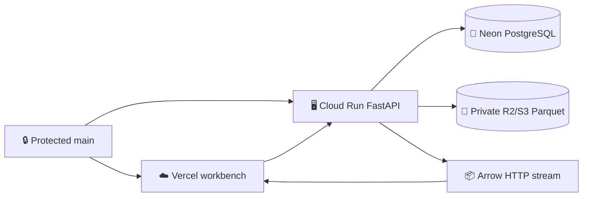
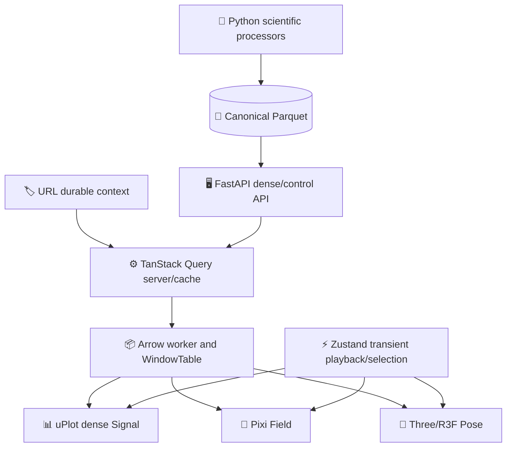

# DynamisData V2 architecture

_Frozen RES-109 contract summary. Machine-readable authority: [`architecture/system-v2.json`](../../../architecture/system-v2.json); schema: [`architecture/system-v2.schema.json`](../../../architecture/system-v2.schema.json)._ 

---

## 🔒 Freeze status

The V2 architecture is frozen at contract version `2.0.3`. The §11 and §12 manual-acceptance amendments record the playhead-driven chunk coordinator, Pose coordinate/camera authority, and atomic observation-aware subject transitions as evidence-backed contract deltas. Routine implementation must conform to it; an architecture change requires evidence, an ADR, a contract version/update, and a dedicated atomic commit.

## 🌐 Runtime topology

Vercel is frontend-only. Cloud Run owns the FastAPI/PyArrow/DuckDB process and its bounded streaming HTTP responses. Neon owns relational registry/control/Gold/provenance/quality/rights metadata. Dense telemetry remains immutable Parquet in a private S3-compatible object plane; the local filesystem adapter is for development and tests only.

## 📊 Selected implementation map

| Concern | V2 authority | Fallback | Evidence |
| --- | --- | --- | --- |
| General analytics | ECharts | Accessible tables | Signal browser benchmark |
| Dense Signals | uPlot adapter | JSON/Arrow compatibility path | Signal browser benchmark |
| Field replay | PixiJS v8 | Bounded empty state | Locked RES-109 boundary |
| Pose hot path | Three/R3F + InstancedMesh + batched geometry | WebGL2 primitive compatibility | Pose benchmark |
| GPU backend | WebGL2 | Future WebGPU seam | WebGPU probe |
| Exact dense read | PyArrow dataset/window | DuckDB compatibility | Dense matrix |
| Broad reduction | DuckDB Parquet SQL | Bounded PyArrow candidate | Dense matrix |
| Scientific compute | Python/NumPy/SciPy/PyArrow | Isolated future kernel | Processor matrix |
| Relational control | PostgreSQL/Neon | Local PostgreSQL/DuckDB Gold | Locked RES-109 boundary |
| Object plane | Private R2-preferred S3-compatible | Local filesystem | Rights/provenance contract |
| Continuous playback | Shared playhead-driven coordinator for Signal/Field/Pose | Explicit `BUFFERING` and JSON compatibility path | ADR-006 / §11 browser acceptance |
| Pose display authority | Body-local or match/world plus named camera ownership modes | Stable fixed-world framing | ADR-006 / §11 browser acceptance |
| Pose subject transition | Artifact/entity observation authority plus atomic subject/time navigation | Explicit switching/no-observation/temporary-absence states | ADR-007 / §12 browser acceptance |

## 🧭 Ownership rules

Renderers consume canonical or explicitly display-reduced representations. They do not calculate scientific metrics, merge subjects, invent topology, smooth data, or bypass rights/provenance.

## ✅ Acceptance surface

The contract requires the implementation units in [`MIGRATION-PLAN.md`](./MIGRATION-PLAN.md), the frozen budgets in `system-v2.json`, and the full scientific/backend/frontend/renderer/performance matrix before RES-109 closure. Production resource provisioning remains RES-107 scope.
