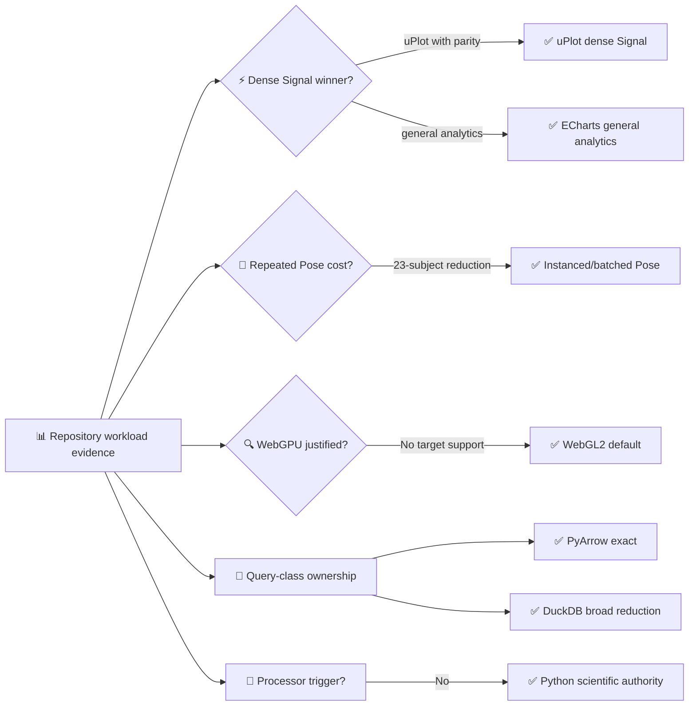

# DynamisData V2 benchmark evidence

_RES-109 benchmark matrix executed at baseline commit `76f9656`; receipts remain outside the repository under the configured evidence cache._

---

## 📋 Method

The harness in [`benchmarks/architecture_v2`](../../../benchmarks/architecture_v2/) runs the same bounded workload classes before and after implementation. Synthetic mode is deterministic and CI-safe. Local mode uses accepted Parquet metadata and windows from the configured external dataset root; it records aggregate timings and sizes only.

The final receipts used for this freeze were:

- browser renderer: 20 iterations at 4,096, 20,000, and 100,000 points;
- Pose scene: 20 iterations at one and 23 subjects × 29 landmarks;
- dense backend: 20 iterations across five synthetic and five accepted/local cases;
- processor hotspot: 20 synthetic iterations plus one bounded local sample;
- WebGPU probe: Chromium headless with WebGL2 and WebGPU capability checks.

## 📊 Signal renderer decision

The browser harness used identical typed arrays, exact samples, NaN gaps, min/max bands, playhead updates, range/zoom changes, and resize probes. Lazy chunk sizes are the uncompressed shipped library files used by the candidate harness.

| Points | ECharts first plot | uPlot first plot | ECharts heap delta | uPlot heap delta | ECharts chunk | uPlot chunk |
| ---: | ---: | ---: | ---: | ---: | ---: | ---: |
| 4,096 | 37.4 ms | 15.7 ms | 13.1 MB | 1.3 MB | 1,121,883 B | 51,081 B |
| 20,000 | 134.0 ms | 31.5 ms | 23.1 MB | 3.1 MB | 1,121,883 B | 51,081 B |
| 100,000 | 1,141.160 ms p95 | 129.270 ms p95 | 503.4 MB | 22.4 MB | 1,121,883 B | 51,081 B |

At 100,000 points, the isolated review-seal receipt reports uPlot at 129.270 ms p95 for first plot and 0.065 ms p95 for playhead updates, versus 1,141.160 ms and 148.567 ms p95 for ECharts. First-plot timing covers one chart; the second chart is created afterward for the observed synchronized-update parity probe. All parity fields are derived from chart state.

**Decision:** adopt uPlot only for the dense Signal Laboratory renderer. Keep ECharts for Overview, Compare, distributions, bars, ranked summaries, scatter/agreement, and BI-style composition. The V2 adapter still owns unit-aware axes, BigInt-safe conversion at the renderer boundary, reduction metadata, accessible keyboard wrapper, deterministic export, and no scientific recomputation.

## 🖥️ Pose hot-path decision

The prototype used shared geometries/materials, one instanced joint/error path, batched line-segment buffers, typed-array mutation, and an instance-to-subject/joint picking map. The baseline emulated the existing independently managed mesh/line objects and per-frame geometry mutation.

| Subjects | Baseline objects/draw calls | V2 prototype objects/draw calls | Baseline frame update | V2 frame update | Picking targets |
| ---: | ---: | ---: | ---: | ---: | ---: |
| 1 | 125 / 125 | 7 / 7 | 0.036 ms | 0.045 ms | 29 |
| 23 | 2,875 / 2,875 | 7 / 7 | 0.207 ms | 0.087 ms | 667 |

**Decision:** adopt the instanced/batched hot path. The one-subject CPU mutation is not faster in isolation, but the repeated 23-subject case delivers the required object/draw reduction and lower frame update while retaining all 667 picking identities. The single-subject and all-subject semantic layer distinctions remain unchanged.

## 🌐 WebGL/WebGPU decision

The local Chromium probe reported WebGL2 available and WebGPU unavailable under the deterministic headless target. The final optimized scene therefore has no measured target-browser WebGPU result that can justify a default switch.

**Decision:** freeze WebGL2 as the V2 default, retain a documented Three WebGPU migration seam, and exclude unused experimental WebGPU production code. Re-open only with a target-browser capability/performance receipt and compatibility evidence.

## 💾 Dense read-path decision

The complete backend harness reports 20-run inclusive p95 for query plus Arrow serialization. `estimated_row_group_bytes` is derived from compressed Parquet row-group statistics; it is a reproducible read estimate rather than an operating-system disk counter. Candidate tables and authoritative metadata are semantically compared before timing acceptance.

| Accepted/local case | Query class | PyArrow | DuckDB | Current service | Returned rows |
| --- | --- | ---: | ---: | ---: | ---: |
| White CMJ | exact | 5.18 ms p95 | 28.75 ms p95 | 64.14 ms p95 | 3,740 |
| GNSS | reduced | 63.48 ms p95 | 156.78 ms p95 | 218.40 ms p95 | 10,000 |
| DFL tracking | reduced | 14.24 ms p95 | 52.95 ms p95 | 100.39 ms p95 | 4,348 |
| SkillCorner pose | bounded exact | 89.87 ms p95 | 73.70 ms p95 | 198.30 ms p95 | 8,961 |
| Maximum allowed | reduced | rejected | 1,568.51 ms p95 | 1,129.47 ms p95 | 61,306 |

Synthetic CI fixtures preserved exact/reduced row budgets for 4k, 20k, 100k, scoped 23-subject pose, and a 500k bounded maximum equivalent. PyArrow wins exact and ordinary reduced windows; DuckDB wins the maximum allowed reduction class and retains the current min/max SQL semantics.

**Decision:** freeze query ownership by class: PyArrow dataset/window operations for exact windows and ordinary scoped reads; DuckDB Parquet SQL for maximum/broad reduced windows and the existing reduction contract. Do not introduce a second dense service. The benchmark gate will reject any implementation that changes returned row identity, reduction metadata, units, or provenance.

## 🧪 Scientific-compute decision

The processor harness measured the existing vectorized Python path rather than replacing it with a new engine.

| Workload | Input rows | Synthetic p50 | Accepted/local sample |
| --- | ---: | ---: | ---: |
| Force CMJ | 1,000 / 1,346 | 1.22 ms | 11.88 ms |
| IMU | 200 / 1,942 | 1.28 ms | 2.66 ms |
| Locomotor tracking | 150 / 100,000 | 5.44 ms | 265.03 ms |
| Pose | 150 | 4.64 ms | — |
| LPT | 100 | 0.67 ms | — |
| Cross-sensor | 200 | 4.32 ms | — |

The observed processors already use NumPy/SciPy/PyArrow contracts and have deterministic scientific tests. No processor hotspot crossed a measured trigger that justifies Polars lazy execution or a Rust/PyO3 kernel while preserving artifact/provenance semantics.

**Decision:** keep Python, NumPy, SciPy, and PyArrow as scientific authorities; explicitly reject Polars and Rust/PyO3 for V2. Rust/DataFusion is also rejected for V2 because the maximum allowed current dense service remains below the frozen 1.5 s single-request service budget on the accepted local workload.

## ✅ Freeze outcomes

The machine-readable contract and individual ADRs in the next freeze commit are authoritative over this summary. After that commit, an architecture choice may change only through evidence, an ADR, a contract version/update, and its own atomic commit.
