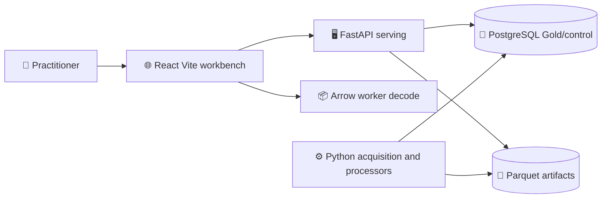

# DynamisData current system

_RES-109 investigation baseline at protected `main` commit `c2c10e2` on 2026-09-21._

---

## 🔍 Investigation scope

This inventory is based on the checked-out source, the codebase-memory graph, the existing synthetic acceptance suite, and summary metadata from the accepted local dataset root. It records implementation facts, not a target design.

The repository contains code, contracts, migrations, tests, generated API typing, and deployment configuration. Scientific data and database state resolve outside the repository through `DYNAMIS_DATASET_ROOT` and `DYNAMIS_DATABASE_ROOT`.

The local accepted dataset inventory used for measurement contains 1,348 Silver Parquet files and 657,168,096 bytes:

| Dataset and modality | Files | Rows | Row groups | Bytes |
| --- | ---: | ---: | ---: | ---: |
| `white-cmj-acc-grf / force` | 663 | 913,800 | 663 | 23,980,147 |
| `white-cmj-acc-grf / imu` | 663 | 1,195,426 | 663 | 32,076,928 |
| `dfl-sportec-idsse / event` | 1 | 1,444 | 1 | 94,050 |
| `dfl-sportec-idsse / tracking` | 2 | 3,362,853 | 53 | 25,280,365 |
| `skillcorner-opendata / pose` | 2 | 44,680,735 | 682 | 553,604,576 |
| `skillcorner-opendata / tracking` | 2 | 1,102,666 | 18 | 8,470,414 |
| `womens-soccer-positioning / gnss` | 15 | 858,542 | 22 | 13,661,616 |

No source rows, raw files, or restricted artifacts are committed by this investigation.

## 🧭 Runtime topology

The web application is a single Vite entrypoint. TanStack Router owns durable analytical context in the URL; TanStack Query owns server/cache state; Zustand owns transient playback, hover, selection, and renderer flags; component state is presentation-only. `usePlaybackClock` advances a BigInt nanosecond playhead through `requestAnimationFrame` and never writes the URL directly.

The serving API is built by `dynamis.serving.app.create_app`. A lazy backend resolves PostgreSQL-backed catalog/control reads and local Parquet dense reads. Tests inject an in-memory/fake backend; production configuration is resolved lazily from environment settings.

## 📊 Baseline gates

The first Python run with an inaccessible workstation temp root was invalid as a product receipt: 381 tests passed and 177 setup errors were caused by filesystem permissions. With an explicit temporary root outside the repository, the meaningful baseline was 555 passed, 3 failures, 16 PostgreSQL tests deselected. The three failures were pre-existing test-environment assumptions caused by the repository-local basetemp path; the final baseline will be rerun with a path outside the checkout.

The web baseline passed 152 Vitest tests, TypeScript typecheck, generated OpenAPI drift check, and ESLint with two existing warnings and no errors.

## 🔐 Non-negotiable authorities

The current code and RES-101/RES-108 contracts establish these authorities for the V2 freeze:

- canonical scientific data and processor semantics remain Python/NumPy/SciPy/PyArrow authorities;
- provenance, rights, measurement class, units, coordinate frames, and checksums remain part of artifact identity;
- display reduction is explicitly non-scientific and never feeds processors;
- Arrow/TypedArray transport is the dense browser representation;
- ECharts currently owns all chart rendering, including dense Signals;
- PixiJS owns ordinary 2D field replay;
- Three.js and React Three Fiber own 3D pose;
- PostgreSQL owns registry/control/Gold/provenance/quality/rights metadata;
- Parquet owns immutable dense telemetry;
- the repository boundary guard rejects source data, database files, credentials, and machine-specific paths.

## 📦 Deployment facts

The repository contains separate API, web, and Dagster Dockerfiles plus a local Docker Compose path. CI already separates Python foundation, PostgreSQL migrations, Node workspace, web checks, browser E2E/accessibility, repository boundaries, and workflow lint. There is no production resource provisioning in this issue.

