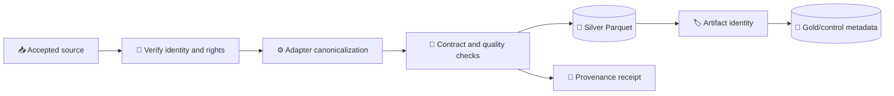
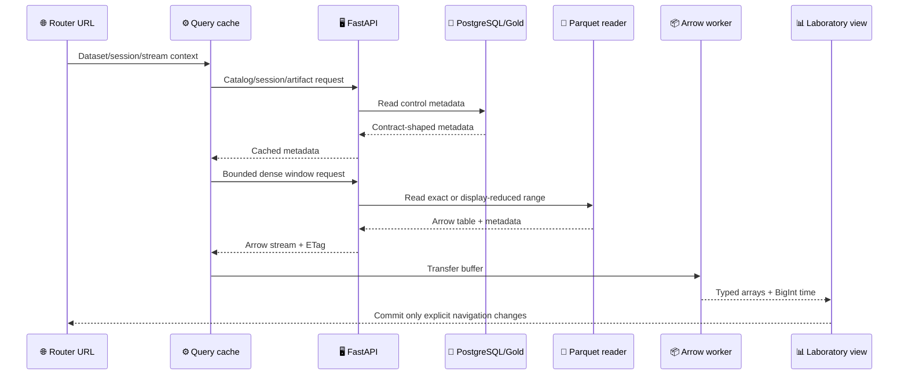
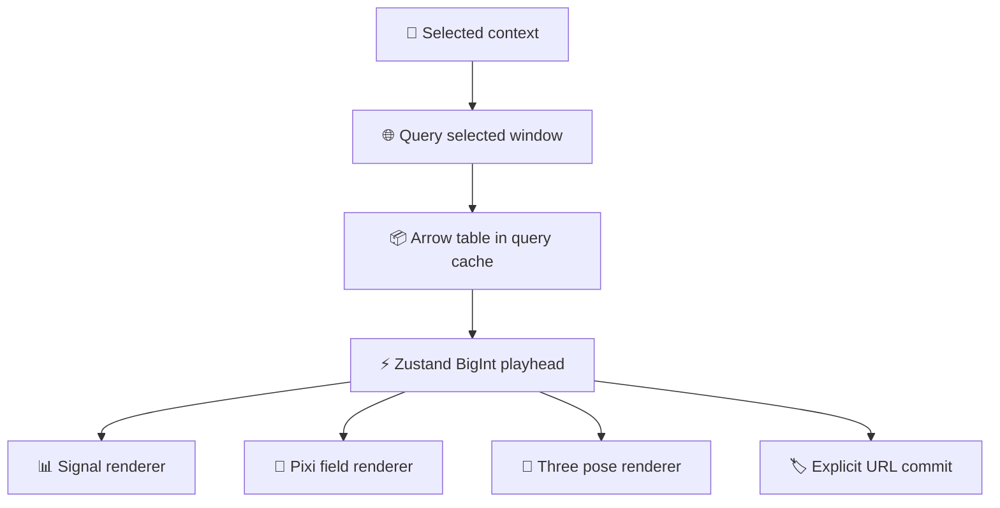

# DynamisData data flow

_Concrete source-to-renderer flows observed on protected `main` before RES-109 refactoring._

---

## 📥 Canonical ingestion flow

The acquisition layer refuses unverified or rights-incompatible materialization. Adapters preserve source/provider semantics while adding explicit SI units, clocks, synchronization, coordinate frames, measurement classes, and declared provenance. The persistence path uses atomic writes and deterministic artifact identity.

## 🌐 Analytical request flow

## 🔄 Playback flow

The current playback path requests a selected window up front and advances a shared BigInt playhead. It is not yet a bounded previous/active/next chunk pipeline; Pose and Signal views consume the same selected context but do not share a canonical chunk cache.

## 📦 Artifact identity flow

Artifact identity is carried from external file to serving response. The dense API never accepts an arbitrary path; it resolves a registered relative path beneath the configured dataset root and checks the expected Parquet extension/file boundary. Response metadata carries artifact identity, canonical time bounds, units, coordinate frame, measurement class, source/returned row counts, reduction details, and a display note.

