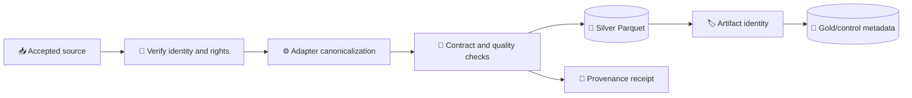
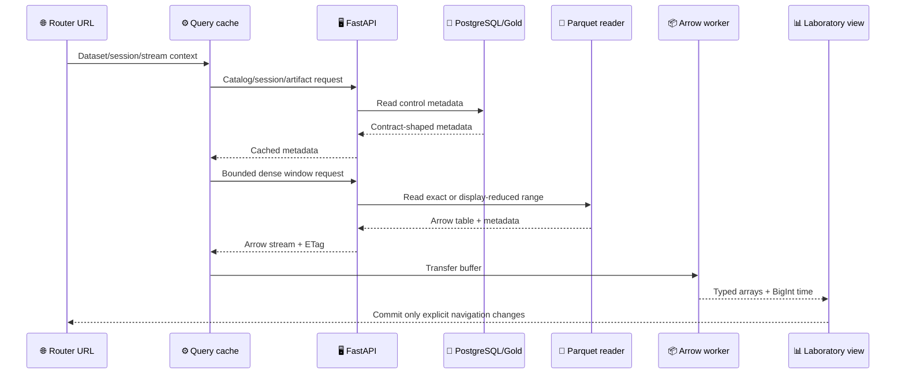
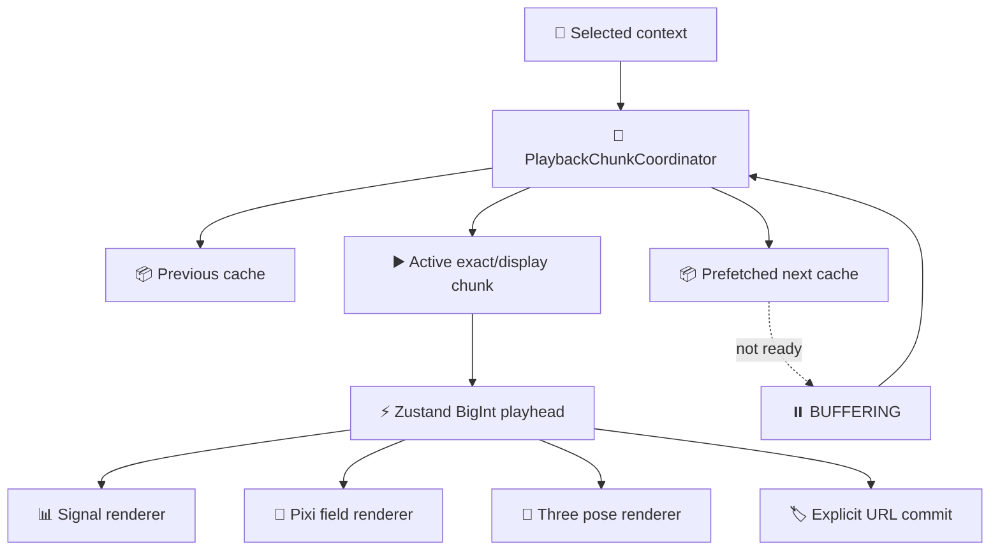

# DynamisData data flow

_Concrete source-to-renderer flows after the RES-109 §11 amendment._

---

## 📥 Canonical ingestion flow

The acquisition layer refuses unverified or rights-incompatible materialization. Adapters preserve source/provider semantics while adding explicit SI units, clocks, synchronization, coordinate frames, measurement classes, and declared provenance. The persistence path uses atomic writes and deterministic artifact identity.

## 🌐 Analytical request flow

## 🔄 Playback flow

The shared `PlaybackChunkCoordinator` plans canonical previous/active/next
chunks from the transient BigInt playhead. Query owns Arrow/JSON data and
prefetches adjacent chunks; the coordinator changes active identity only at a
boundary, clamps the clock in explicit `BUFFERING` when an exact next chunk is
not ready, and evicts outside the three-chunk cache. Pose and Field use exact
handoff data; dense Signals retain explicit display-reduction metadata.

## 📦 Artifact identity flow

Artifact identity is carried from external file to serving response. The dense API never accepts an arbitrary path; it resolves a registered relative path beneath the configured dataset root and checks the expected Parquet extension/file boundary. Response metadata carries artifact identity, canonical time bounds, units, coordinate frame, measurement class, source/returned row counts, reduction details, and a display note.
