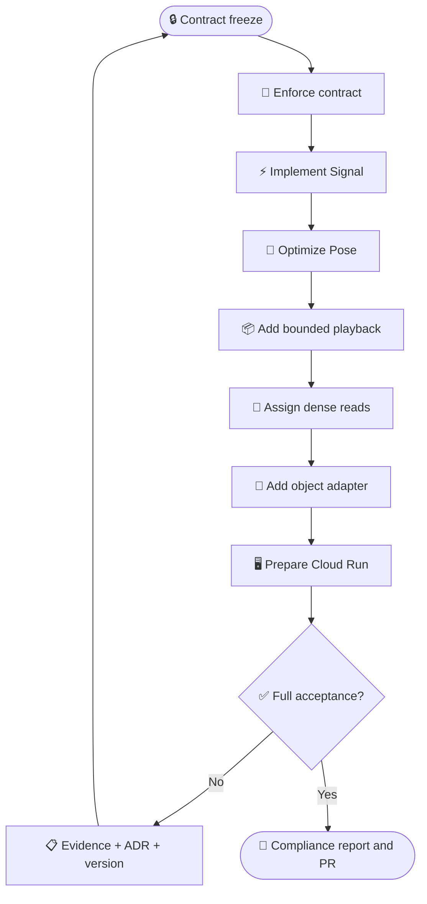

# DynamisData V2 migration plan

_Implementation order after the RES-109 contract-freeze commit._

---

## 📋 Unit sequence

| Unit | Scope | Status at freeze | Atomic commit evidence |
| ---: | --- | --- | --- |
| 1 | Contract validation and repository boundary gate | Frozen; validator committed with contract | `system-v2.json` validation receipt |
| 2 | uPlot dense Signal adapter and ECharts removal from dense path | Contracted; not started | renderer parity and browser receipt |
| 3 | Instanced/batched Pose hot path | Contracted; not started | object/draw/frame receipt |
| 4 | WebGPU experiment and WebGL2 freeze | Frozen negative decision | WebGPU probe receipt |
| 5 | Bounded previous/active/next Arrow playback chunks | Contracted; not started | boundary, cancellation, memory tests |
| 6 | PyArrow exact and DuckDB reduced read ownership | Contracted; not started | endpoint before/after receipt |
| 7 | Rust/DataFusion trigger decision | Frozen negative decision | maximum-request receipt |
| 8 | Polars/PyO3 trigger decision | Frozen negative decision | processor receipt |
| 9 | Private S3-compatible/R2-preferred object adapter | Contracted; not started | checksum/range/rights/reconciliation tests |
| 10 | Cloud Run API container/runtime readiness | Contracted; not started | build/health/resource receipt |
| 11 | Full architecture acceptance and compliance report | Contracted; not started | complete matrix and PR |
| 12 | §11 manual-acceptance amendment: shared playhead coordinator, exact multi-boundary handoff, Pose coordinate/camera authority, and auxiliary-layer synchronization | Required before PR review | ADR-006, unit/browser receipts, updated contract/compliance report |

## 🔄 Implementation flow

WebGPU, native-service, and scientific-compute negative decisions are not implementation units unless their frozen triggers are later met through the amendment rule. RES-107 remains the owner of actual production provisioning and promotion.
