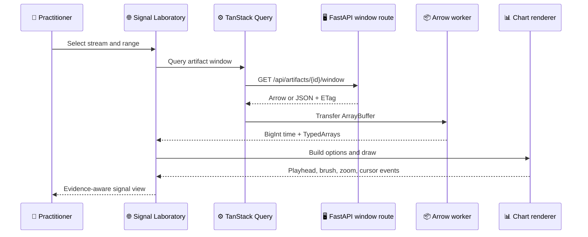

# DynamisData module inventory

_Evidence-backed module boundaries for RES-109 before the V2 contract freeze._

---

## 📋 Module map

| Module | Runtime owner | State owner | Actual entrypoints | Current transport/storage | Boundary decision |
| --- | --- | --- | --- | --- | --- |
| Product shell | React/Vite | Router + Query + Zustand | `apps/web/src/main.tsx`, router, routes | HTTP/OpenAPI | Keep the locked ownership split |
| Durable context | TanStack Router | URL search params | `AnalysisContextProvider` | URL strings, BigInt parse/format | Keep; route commits are explicit |
| Server/cache state | TanStack Query | Query cache | `queries.ts`, `useDenseWindow` | JSON or Arrow HTTP | Keep; no server data in Zustand |
| Transient analysis state | Zustand | `useAnalysisStore` | `state/analysis.ts` | BigInt times and selection | Keep; no URL writes at frame cadence |
| Signal analytics | ECharts | Query/table + Zustand interaction | `SignalLaboratory`, `EChart`, `signal-options.ts` | Arrow → typed arrays → ECharts option | Benchmark dense renderer; ECharts remains general analytics |
| Field replay | PixiJS v8 | Imperative renderer state | `PitchReplay`, `pitch-renderer.ts` | Arrow-derived frame models | Keep Pixi for ordinary replay |
| Pose replay | R3F/Three | Zustand + renderer refs | `PoseViewer`, `PoseScene.tsx` | Arrow-derived exact pose frames | Rebuild hot path after freeze |
| Arrow decode | Web Worker/Comlink | Worker-local decode | `arrow.worker.ts`, `decodeWindowOffThread` | IPC ArrayBuffer | Keep; transfer buffers |
| Control API | FastAPI/Pydantic | Backend/repository | `serving/app.py` | OpenAPI JSON | Keep FastAPI authority |
| Dense API | FastAPI + PyArrow/DuckDB | Request-local | `serving/dense.py` | Parquet window → Arrow/JSON | Freeze query ownership by measured class |
| Control plane | PostgreSQL/SQLAlchemy | PostgreSQL | `serving/repository.py`, storage tables | SQL/Gold Parquet mirror | Keep PostgreSQL authority |
| Dense storage | Parquet/PyArrow | External dataset root | `storage/parquet.py`, `storage/paths.py` | Immutable Parquet + checksums | Keep Parquet; never move telemetry to PostgreSQL |
| Scientific compute | Python processors | Processor/artifact contracts | `processors/*`, orchestration | Arrow batches → Parquet | Keep Python; trigger Polars/PyO3 only with evidence |
| Rights/provenance | Python contracts | Artifact metadata + receipts | `rights.py`, contracts, manifests | JSON receipts/Gold metadata | Preserve all gates |
| Runtime packaging | Docker/Cloud Run-ready API | Environment contract | `infra/docker/api.Dockerfile` | Container + external roots | Prepare adapter/config; no live provisioning |

## 🌐 Product/workbench paths

The route shell uses durable URL search fields for dataset, session, trial, subject, stream, time range, metric, and result context. `AnalysisContextProvider` parses and normalizes those fields, then exposes explicit `commitTime`/`commitRange` callbacks for navigation boundaries.

The Signals path is:

The current Signal renderer imports ECharts lazily, initializes a Canvas renderer, binds click/dataZoom/resize events, and replaces options on query/table updates. It owns display composition only; canonical times remain BigInt-safe until conversion at the renderer boundary.

The Field path uses `PitchReplay` with `pitch-renderer.ts`. The renderer creates shared Pixi Graphics layers and imperatively updates a small vocabulary of scene objects at frame cadence; entity semantics distinguish detected and extrapolated positions, and selection has a ring/crosshair affordance.

The Pose path selects one or all subjects, queries exact pose windows with `entity_id` scoping, and passes provider connections plus analytical/display overlays to `PoseScene`. The current single-subject scene manages one `<mesh>`/geometry/material per discovered joint name and one dynamic line component per enabled skeleton, cue, segment, or angle. Playback updates positions and lines inside `useFrame`; React state is not set by the frame loop.

## 🖥️ Serving/data paths

`create_app` exposes catalog, session, metric, methodology, provenance, rights, quality, run, artifact, and dense-window routes. The injected `ServingBackend` abstraction separates HTTP route shape from repository access. The PostgreSQL backend reads control/Gold metadata; dense windows resolve registered relative artifact paths beneath the configured dataset root, reject traversal, validate requested columns, count source rows, and either return an exact window or a bounded min/max display reduction.

Dense client requests use `fetchWindowArrow`, which sends `Accept: application/vnd.apache.arrow.stream`, falls back to JSON when the server does not return Arrow, transfers successful buffers to a Worker through Comlink, and preserves response metadata. ETags are handled at the API client boundary.

## ⚙️ Scientific compute paths

Acquisition resolves accepted source members into Bronze, adapters canonicalize into Arrow batches, processor functions operate on typed arrays/Arrow tables, and persistence writes immutable Silver/Gold artifacts with provenance and checksums. The graph shows processor clusters in `processors/force_cmj.py`, `imu.py`, `locomotor.py`, `lpt.py`, `pose.py`, `signals.py`, and `statistics.py`; no measured hotspot has yet authorized a new execution engine.

## 💾 Storage/control paths

The storage layout creates external `bronze`, `silver`, `gold`, `quarantine`, `cache`, and `tmp` roots. PostgreSQL migrations define registry/control tables and serving indexes; a local DuckDB file supports Gold/analytical reads. Dense files remain outside PostgreSQL and are referenced through artifact metadata, relative paths, checksums, row counts, units, measurement class, coordinate frame, and processing provenance.

